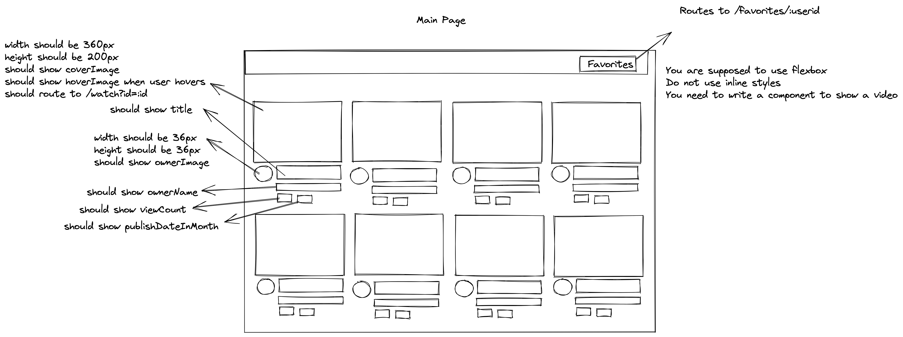
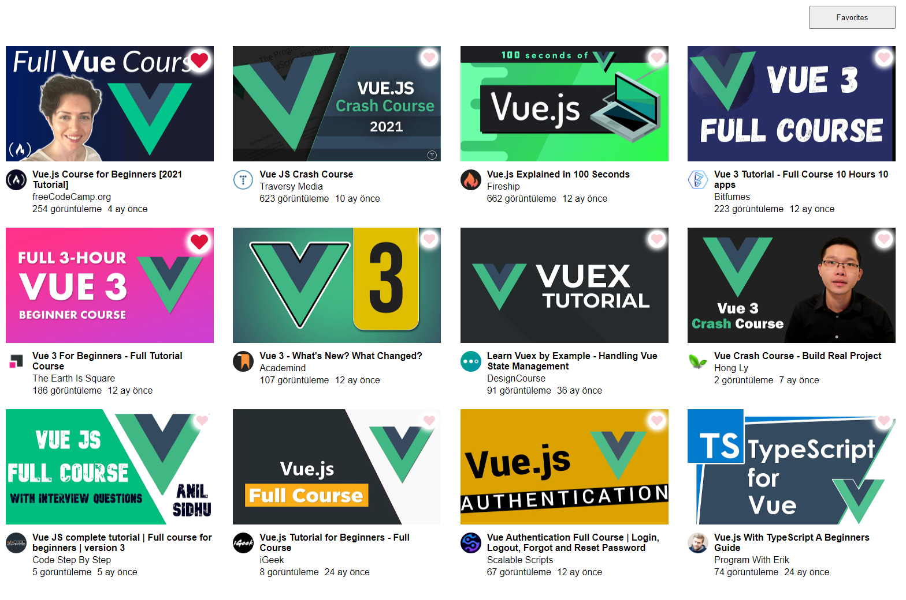
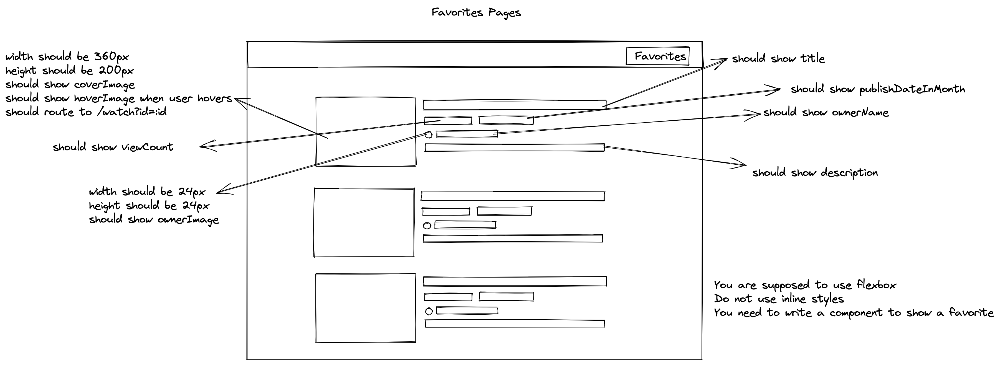
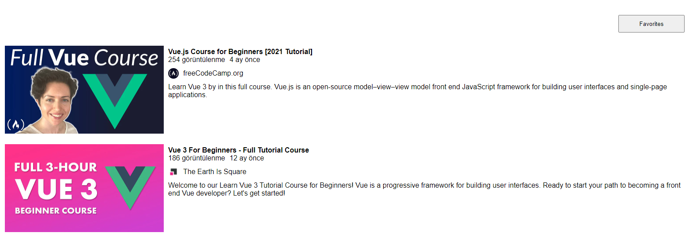

# Bootcamp Week 2 Assignment

 Screenshots of the requested assignments are attached below.

There are 3 pages you need to design: main, favorite and watch page respectively. You need to use router for displaying the pages. When user clicks to the favorite button, you should
use "bootcamp" as param.

## Before you begin

Make sure that you installed all the node packages with `npm install` or `yarn install`

## Data source

For the assignment, you can get data required from the link below:

https://my-json-server.typicode.com/modanisa/bootcamp-video-db/videos

## Watch page

Watch page should display the id of video. You are not supposed to do any design for this page.

## Home page

You need to design a homepage is seen in the picture below.

Do not make a responsive design.
###Requested

###Result

## Favorite page

For the favorite page, You need to design a page as seen in the picture below.

Favorite page should list the videos whose favorite field are set to true in the data.

###Requested

###Result

